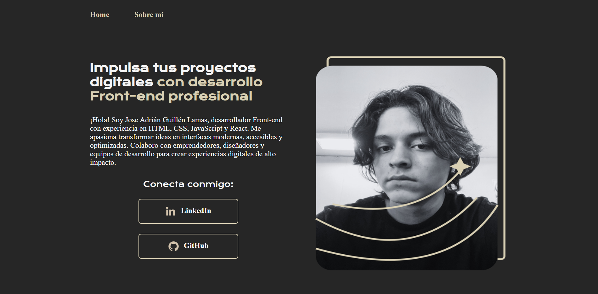

# 🌐 Portafolio Web Personal

Este proyecto es mi portafolio personal, desarrollado con **HTML** y **CSS**, donde presento información sobre mí, mis habilidades y mis enlaces profesionales.  
Fue creado como parte de mi aprendizaje en **Alura Latam**, pero adaptado para que refleje mi perfil real y pueda servir como carta de presentación en línea.

🚀 **Desplegado en:** [https://portafolio-guillena7-seven.vercel.app/](https://html-y-css-guillena7s-projects.vercel.app/)

---

## 📸 Vista previa



---

## 🔨 Funcionalidades

- Página principal con presentación profesional y enlaces a redes.
- Sección "Sobre mí" con información personal y habilidades.
- Diseño responsive para dispositivos móviles y escritorio.
- Paleta de colores y tipografía personalizadas.

---

## ✔️ Tecnologías utilizadas

- **HTML5** – Estructura semántica y accesible.
- **CSS3** – Estilos, layout con Flexbox y diseño responsive.
- **Google Fonts** – Tipografías *Krona One* y *Montserrat*.
- **Vercel** – Despliegue y hosting.

---

## 📁 Acceso al proyecto

Puedes **clonar este repositorio** con:

```bash
git clone https://github.com/GuillenA7/portafolio.git
```

O verlo directamente en producción en:
[https://portafolio-guillena7-seven.vercel.app/](https://portafolio-guillena7-seven.vercel.app/)

---

## 🛠️ Cómo ejecutar el proyecto

1. Clona este repositorio:

```bash
git clone https://github.com/tuusuario/portafolio.git
```

2. Entra en la carpeta del proyecto:

```bash
cd portafolio
```

3. Abre el archivo index.html en tu navegador.

---

## 📚 Créditos

Este proyecto fue inspirado y desarrollado durante el curso de HTML y CSS de [Alura Latam](https://www.aluracursos.com/), adaptado para ser mi portafolio personal.

---

### ✉️ Conecta conmigo

* [LinkedIn](https://www.linkedin.com/in/jose-adrian-guillen-lamas-3b3b5135b/)
* [GitHub](https://github.com/GuillenA7)
* [Instagram](https://www.instagram.com/namelessdoodle/?hl=es)